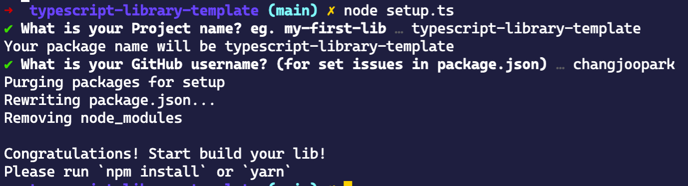

# TypeScript Library Template

The typescript library template for both node.js and browser. This template based on [tsdx](://github.com/formium/tsdx).

## Usage

Click **use this template**


Open your terminal and follow this lines

```bash
git clone <this repository url> <package name>
cd <package name>

npm install # For setup
node setup.ts # For fill your new npm with interactive shell
```



```bash
npm install # For clean your dependencies
code . # Or open your favorite editor.

# Start build your own package!
```


## Development this template.


## Contributors

You can first contributor of this template!